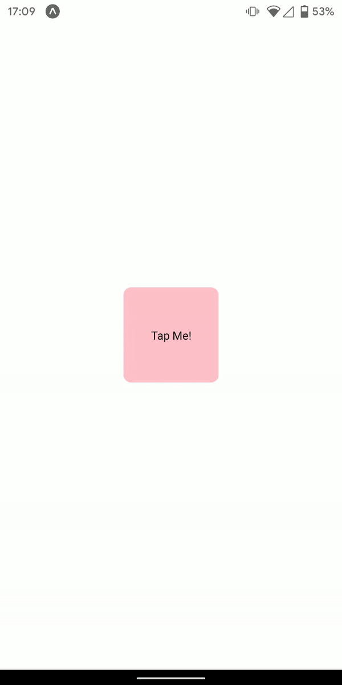

[](https://www.npmjs.com/package/react-native-tap)
[](https://www.npmjs.com/package/react-native-tap)
[](https://github.com/sarthakpranesh/react-native-tap/stargazers)

# react-native-tap

Simple React Native components to implement custom and interesting multi tap and long press interactions.



<br />

## Installation

Using yarn:
```bash
yarn add react-native-tap
```

Using npm:
```
npm i react-native-tap
```

Dependency: Make sure you have `react-native-gesture-handler` installed

<br />

## Usage

Using Bare multi tap component
```js
import {MultiTap} from 'react-native-tap';
```

Example usage
```
<MultiTap onSingleTap={() => console.log("Single tap")} onDoubleTap={() => console.log("Double tap)}>
    <View style={styles.box}>
        <Text>Tap Me!</Text>
    </View>
</MultiTap>
```

<br />

## Expo Example
Their is expo example present in the `example` directory for you to try out.
Instructions, make sure `expo-cli` is installed
1. `git clone https://github.com/sarthakpranesh/react-native-tap.git`
2. `cd react-native-tap/example`
3. `yarn install`
4. `expo start` and scan the QR code from expo client mobile app

<br />

## Documentation
MultiTap component

|Name   |Description    |Default    |Type |
|---    |---            |---        |---  |
|onSingleTap    |Function called on a single tap on component    | () => {}    |Func   |
|onDoubleTap    |Function called on a double tap on component    | () => {}    |Func   |

<br />

## Future Components

These components will be provided in future versions
|Component Name |Description    |
|---    |---    |
|ReactiveIcon   |Will provide basic animated icons using Animated api in React Native. The component will implement both onSingleTap and onDoubleTap functionalities|

<br />

## Contributions
Feel free to open GitHub issues for feature request, bugs or discussions, and Pull request are always Welcomed!

<br />

## License
[MIT](https://github.com/sarthakpranesh/react-native-tap/blob/master/LICENSE)
